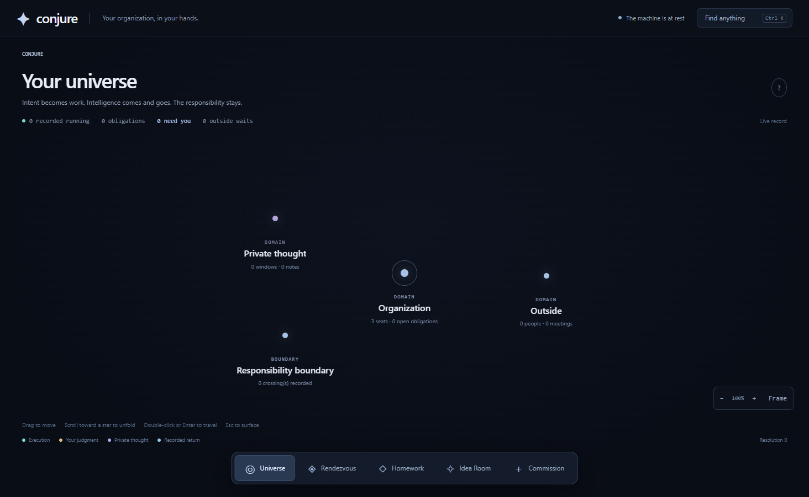
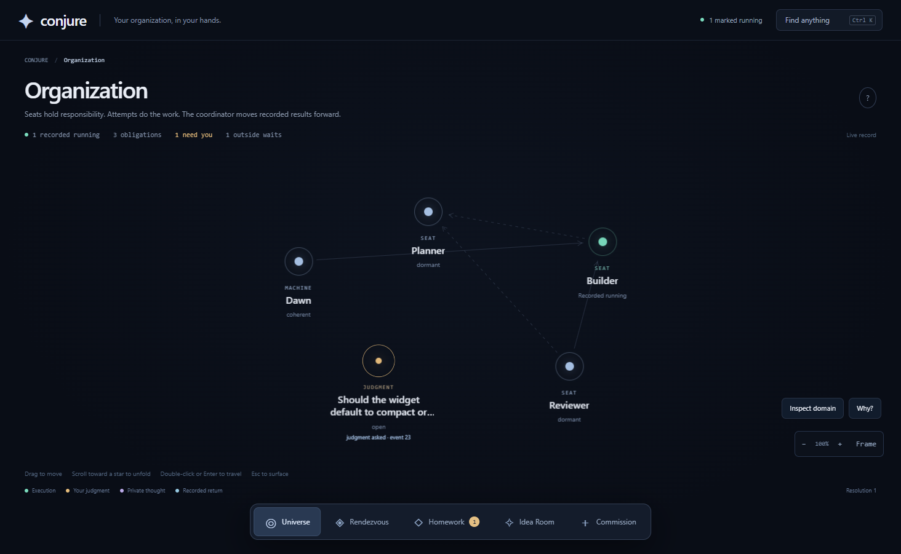

<p align="center">
  
</p>

# Conjure

**A desktop organization for AI work.** You commission work. Conjure keeps the responsibility, hands the actual work to AI coding agents you already have (Claude Code, Codex, or your own CLI), and brings back either a usable result or a genuine question for you to answer. Everything that happened stays inspectable.

Created and maintained by **Donne Berberabe**. Licensed under **Apache 2.0**.

> **Status: early public preview (v0.1.0).** Windows x64 is the tested platform. The core engine is plain Node and should run elsewhere, but only Windows has been exercised end to end. Expect rough edges; please report them.

---

## Why Conjure

Running AI agents by hand means you become the project manager: remembering what each session knew, noticing when the brief changed, ferrying decisions between windows, and guessing whether a result is still current. Conjure takes that bookkeeping off you.

- **Responsibility is durable.** Work is an obligation held by a seat, not by a chat session. A provider can crash, time out, or be swapped and the obligation survives.
- **Nothing is closed on a model's word.** A worker's "done" becomes a review; only a passing review or your own decision closes work.
- **Every attempt has a receipt.** The exact prompt, context, workspace and output are recorded before the provider runs, so you can see what a result was based on and whether it has gone stale.
- **Your private thinking stays private.** The Idea Room is a workbench for notes and thinking windows that never reach the organization unless you deliberately hand something over.
- **Cold software moves the work.** A deterministic reconciler decides what happens next. Models are allocated only when something changed.

## What you can do with it

- Build a small organization of **seats** (Planner, Builder, Reviewer by default), each with a charter, a workspace and a preferred provider.
- **Commission** work from a directive or a note; watch it become obligations, attempts, reviews and returns.
- Answer **Homework**: the questions only you can decide, with the consequences of each answer shown.
- Keep **meetings**, **people** and **outside waits** on the map, so human dependencies are visible next to machine ones.
- Design a **workflow graph** and see exactly which parts of it are executable versus recorded intent.
- Register an **experimental provider** (any CLI that takes a prompt and prints an answer) and try it in a private window before promoting it to real work.
- Navigate all of it as one persistent **universe**: click to inspect, double-click to unfold, scroll toward a star to travel, `Ctrl+K` to find anything.

<p align="center">
  
</p>

## What you need

| Requirement | Notes |
| --- | --- |
| **Node.js 24 or newer** | The engine's SQLite module is built for the Node 24 ABI. |
| **pnpm** (recommended) or npm | `corepack enable` gives you pnpm; see [docs/INSTALL.md](docs/INSTALL.md). |
| **At least one AI provider CLI, signed in** | [Claude Code](https://docs.anthropic.com/en/docs/claude-code) (`claude`) and/or [OpenAI Codex CLI](https://github.com/openai/codex) (`codex`). Conjure calls them as child processes; it holds no API keys of its own. |
| **Windows 10/11 x64** for the desktop app | The engine and the browser UI also run on macOS/Linux, untested. |

Conjure has no accounts, no server and no telemetry. State lives in `~/.conjure` on your machine.

## Install and start

**Option A: portable Windows build (no toolchain).** Download `Conjure-win-x64-portable.zip` from the [latest release](https://github.com/donkits1/conjure-free/releases), unzip it anywhere, keep the folder together, and double-click `Conjure.exe`. It is unsigned, so Windows SmartScreen will ask you to confirm the first time.

**Option B: from this repository.**

```bash
git clone https://github.com/donkits1/conjure-free.git
cd conjure-free
pnpm install          # installs the engine's dependencies and downloads Electron
pnpm desktop          # opens the Conjure desktop (pnpm desktop:windowed for a normal window)
```

No Electron? The engine works from a normal browser too:

```bash
pnpm start                          # starts the supervisor + gateway on http://127.0.0.1:7790
node core/dist/cli.js browser-url   # prints a one-time login URL; open it in your browser
pnpm stop                           # stops the organization
```

Full instructions, environment variables and troubleshooting: **[docs/INSTALL.md](docs/INSTALL.md)**.

## Shortest path to seeing it work

1. Start Conjure. You arrive in **Your universe** with three dormant seats and nothing open.
2. Run `pnpm doctor` (or read the header) to confirm at least one provider says *Usable now: yes*.
3. Open **Organization**, pick a seat, choose **Configure → Browse** and authorize a project folder as its workspace. Nothing touches your files until you do this.
4. Open **Commission** and describe a small task with a clear acceptance criterion.
5. Watch the obligation appear, an attempt start, a review run, and either a **return** land in **Rendezvous** or a question land in **Homework**.
6. Click the attempt to see its receipt: the exact brief, the context it was given, and the raw provider output.

Prefer to think first? Open **Idea Room**, write a note or talk to a private window, and use **Hand to Conjure** when it is ready to become work.

## Project layout

```
app/    Electron desktop container (windows, tray, notifications, lifecycle)
core/   the engine: supervisor, gateway, reconciler, providers, projections, web UI, check suite
docs/   installation, architecture, providers, source notes
```

The engine and desktop ship as readable JavaScript; the browser UI ships as a built bundle. See [docs/SOURCE.md](docs/SOURCE.md) for what that means and what it does not.

## Documentation

- [Install and troubleshooting](docs/INSTALL.md)
- [Providers: Claude, Codex, and bringing your own CLI](docs/PROVIDERS.md)
- [Architecture](docs/ARCHITECTURE.md)
- [Source status](docs/SOURCE.md)
- [Changelog](CHANGELOG.md)

## Problems, ideas, contributions

- **Bugs and questions:** [open an issue](https://github.com/donkits1/conjure-free/issues).
- **Security issues:** please do not open a public issue; see [SECURITY.md](SECURITY.md).
- **Contributing:** bug reports and useful improvements are welcome. Forks and private modifications are fine under the license. What lands in canonical Conjure is decided by the maintainer. See [CONTRIBUTING.md](CONTRIBUTING.md).

## Support Conjure

Conjure is free and built by one person. If it saves you time and you want to help it keep going:

- Cash App: **[$DonneBerberabe](https://cash.app/$DonneBerberabe)**
- Venmo: **[@Donne-Berberabe](https://venmo.com/u/Donne-Berberabe)**

Stars, bug reports and word of mouth help just as much.

## License and branding

Conjure is licensed under the [Apache License 2.0](LICENSE): use it, modify it, keep your changes private, ship it inside commercial products. The Conjure name, emblem and the identity of this canonical project are not part of that grant; see [NOTICE](NOTICE). Third-party components are listed in [THIRD-PARTY-NOTICES.md](THIRD-PARTY-NOTICES.md).
